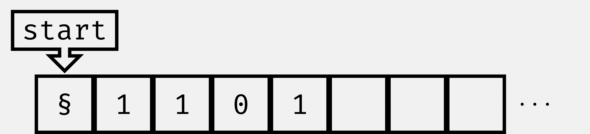
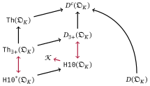

# Hilbert's tenth problem, Turing machines, and decidability

## Hilbert's tenth problem

\DeclareMathOperator{\N}{\mathbb{N}}
\DeclareMathOperator{\Z}{\mathbb{Z}}
\DeclareMathOperator{\Q}{\mathbb{Q}}
\DeclareMathOperator{\R}{\mathbb{R}}
\DeclareMathOperator{\C}{\mathbb{C}}
\DeclareMathOperator{\F}{\mathbb{F}}

\DeclareMathOperator{\Aut}{Aut}
\DeclareMathOperator{\id}{id}

\DeclareMathOperator{\kernel}{ker}
\DeclareMathOperator{\im}{im}
\DeclareMathOperator{\rk}{rk}
\DeclareMathOperator{\End}{\mathrm{End}}
\DeclareMathOperator{\Hom}{\mathrm{Hom}}
\DeclareMathOperator{\D}{\mathrm{D}}
\DeclareMathOperator{\lcm}{\mathrm{lcm}}
\DeclareMathOperator{\ord}{\mathrm{ord}}

\newcommand*{\sta}{\texttt{\S}}
\newcommand*{\emp}{{\monomath \_}}
\newcommand*{\zer}{\mathtt 0}
\newcommand*{\one}{\mathtt 1}
\newcommand*{\state}[1]{s_{\text{#1}}}
\newcommand*{\sstart}{\state{start}}
\newcommand*{\shalt}{\state{halt}}
\newcommand*{\scheck}{s_{\text{check}}}
\newcommand*{\enc}[1]{\ulcorner #1 \urcorner}
\newcommand*{\rel}[1]{\mathrel{\MakeUppercase #1}}
\newcommand*{\algint}[1][K]{\mathcal{O}_{#1}}
\newcommand*{\modalgint}[1][K]{\mathfrak{O}_{#1}}
\newcommand*{\Norm}[1][L/K]{\mathrm N_{#1}}
\newcommand*{\px}{\mathrm x}
\newcommand*{\py}{\mathrm y}
\newcommand*{\sigmaK}[1]{{\left(#1\right)}^*}
\newcommand{\set}[1]{\left\lbrace #1 \right\rbrace}
\newcommand*{\seq}[2][n]{{#2}_1, \ldots, {#2}_{#1}}
\newcommand*{\lang}{\mathcal{L}}
\newcommand*{\Quot}{\mathrm{Quot}}
\newcommand*{\Mod}{\mathrel{\mathrm{mod}}}

:::::::::::::: {.columns}
::: {.column width="65%"}
> Given a Diophantine equation with any number of unknown quantities and with
> 
    rational integral
  
> numerical coefficients: To devise a
> 
    process
  
> according to which it can be
> 
    determined
  
> by a
> 
    finite number of operations
  
> whether the
> 
    equation is solvable
  
> in
> 
    rational integers.
  
>
> – @Hilbert1900
:::
::: {.column width="30%"}
![Portrait of David Hilbert (1912) [Published in @Reid1970]](imgs/Hilbert.jpg){#fig:David-Hilbert}
:::
::::::::::::::

## Decision problems

### Definition

A *decision problem* is a subset of the set of finite $\mathtt 0$-$\mathtt
1$-strings $ω = \lbrace \mathtt{0, 1} \rbrace^*$ including the empty string
$\lambda$.

An injective function $\mathcal{Q} → ω, \; x ↦ \enc{x}$ is called an *encoding*.

. . .

#### Example: Simple graphs

The set of all simple graphs can be encoded by strings of the form

$$
    \begin{array}{lllll}
        x := & b_{1, 2} & b_{1, 3} & …      & b_{1, n}\\
             &    & b_{2, 3} & …      & b_{2,n}\\
             &    &          & \ddots & \vdots \\
             &    &          &        & b_{n-1, n}.
    \end{array}
$$

## Turing machines

:::::::::::::: {.columns}
::: {.column width="55%"}

### Definition

A *Turing machine* $\mathbb{A}$ on the *alphabet*
$A = \lbrace\mathtt{\sta, \_, 0, 1}\rbrace$ consists of

*  a finite *set of states* $S$ containing $s_{start}, s_{halt}$ and
*  a *transition function*

$$δ: S \times A \to S \times A \times \lbrace -1, 0, 1 \rbrace.$$

:::
::: {.column width="40%"}
{#fig:add1}
:::
::::::::::::::

. . .

I write $\mathbb{A}(x)$ for the output of Turing machine $\mathbb{A}$ on input
$x ∈ ω$ if $\mathbb{A}$ halts on $x$.

## Computability, decidability, and semi-decidability

### Definition

> * A partial function $f: ω \to ω$ is *computable* if there is a Turing
  machine $\mathbb{A}$ with $\mathbb{A}(x) = f(x)$ for all $x$ in the domain
  of $f$.
> * A decision problem $Q$ is *decidable* if its characteristic function
  𝟙${}_Q$ is computable.
> * A decision problem $Q$ is *semi-decidable* or *computably enumerable* if
  there exists a Turing machine $\mathbb{A}$ such that
  $$x ∈ Q \quad ⇔ \quad \mathbb{A}(x) = \one.$$

## The halting set

### Definition

The *halting set* is the set of all codes of Turing machines $\mathbb{A}$
that halt upon receiving their code as input i.e.

$$\mathcal{K} :=
  \set{\enc{\mathbb{A}} \mid \mathbb{A} \text{ halts on } \enc{\mathbb{A}}}$$

. . .

#### Theorem

The halting set $\mathcal{K}$ is semi-decidable but not decidable.

::: notes
Assume $\mathbb{B}$ decides the halting set i.e.

$$\mathbb{B}(\enc{\mathbb{A}}) =
\begin{cases}
  \one & \text{if } \mathbb{A} \text{ halts on } \enc{\mathbb{A}} \\
  \zer & \text{otherwise}
\end{cases}.
$$

Consider $\mathbb{B}'$ defined by

$$\mathbb{B}'(\enc{\mathbb{A}}) =
\begin{cases}
  \one & \text{if } \mathbb{B}(\enc{\mathbb{A}}) = \zer \\
  \uparrow & \text{otherwise}
\end{cases}.
$$

What is $\mathbb{B}'(\enc{\mathbb{B}'})$?
:::

<!--
███    ██ ██    ██ ███    ███        ████████ ██   ██ ███████  ██████
████   ██ ██    ██ ████  ████           ██    ██   ██ ██      ██    ██
██ ██  ██ ██    ██ ██ ████ ██           ██    ███████ █████   ██    ██
██  ██ ██ ██    ██ ██  ██  ██           ██    ██   ██ ██      ██    ██
██   ████  ██████  ██      ██ ██        ██    ██   ██ ███████  ██████  ██
-->
# Some number theory

## Algebraic integers

### Definition

An element $α \in ℂ$ is called *algebraic integer* if there exists a monic
polynomial $p \in ℤ[X]$ such that

$$p(α) = α^n + c_{n - 1} α^{n - 1} + … + c_0 = 0$$

> * We write $\algint[]$ for the set of all algebraic integers …
> * … and if $K$ is a number field, i.e. $K$ is finite extension of $ℚ$,
    we set $\algint = \algint[] ∩ K$.
> * For $K = ℚ$ we find $\algint[ℚ] = \algint[] ∩ ℚ = ℤ$.

## Properties of algebraic integers

### Proposition

> * Both $\algint[]$ and $\algint$ are sub-rings of $ℂ$ (for all $K$).
> * $\algint$ is a finitely generated free $ℤ$-module (for all $K$). A basis
  is called *integral basis*.
> * The quotient field of $\algint$ is (isomorphic to) $K$.

<!--
██████  ██  ██████  ██████  ██   ██        ███████ ███████ ████████ ███████
██   ██ ██ ██    ██ ██   ██ ██   ██        ██      ██         ██    ██
██   ██ ██ ██    ██ ██████  ███████        ███████ █████      ██    ███████
██   ██ ██ ██    ██ ██      ██   ██             ██ ██         ██         ██
██████  ██  ██████  ██      ██   ██ ██     ███████ ███████    ██    ███████
-->
# Diophantine sets {.sectiontitle}

At the core of Hilbert's Problem

## Diophantine Sets

### Definition

Let $R$ be a commutative ring with unit. A set $S \subseteq R^n$ is called
*Diophantine* if there exists a polynomial $p \in R[\seq{X}, \seq[m]{Y}]$ such
that

$$(\seq{α}) \in S \Leftrightarrow \exists \seq[m]{y} \in R^m : p(\seq{α},
\seq[m]{y}) = 0$$

## Examples of Diophantine Sets

Let $R$ be an integral domain. Then every finite set $S \subset R$ is
Diophantine.

. . .

### Proof

Take

$$p(X) = \prod_{α ∈ S} (X - α).$$

## Examples of Diophantine sets

The set of natural numbers $ℕ$ is Diophantine over $ℤ$.

. . .

### Proof

Using Minkowski's theorem on convex bodies one can prove that

$$α ∈ ℕ \quad \Leftrightarrow \quad \exists β_1, β_2, β_3, β_4 \in
  ℤ: α = β_1^2 + β_2^2 + β_3^2 + β_4^2.$$

This fact is known as Lagrange's foure square theorem.

::: notes
One proves that $0, 1, 2$ can be presented this way and that if $a, b$ are sums
of four squares, so is $ab$. Thus, one proves the claim for odd primes $p$, by
considering the lattice of solutions

By the pigeonhole principle there exist integers $m, n ∈ \set{0, 1, …, p - 1}$
solving the congruence
$$
  m^2 + n^2 + 1 \equiv 0 \mod p.
$$

For a fixed solution $(m, n)$ of the above congruence, we consider the set
$Λ$ of all integral solutions $(a, b, c, d) ∈ ℤ^4$ of the simultaneous
congruence
$$
  c \equiv m a + n b \mod p \quad \text{and} \quad
  d \equiv m b - n a \mod p.
$$
:::

## Examples of Diophantine sets

Let $K$ be a number field and $\algint$ its ring of algebraic integers.
Then $\algint \setminus \set{0}$ is Diophantine over $\algint$.

. . .

### Proof

Using the Chinese remainder theorem one can prove that

$$α ≠ 0 \quad ⇔ \quad ∃ β, γ ∈ \algint : α β = (2 γ - 1)(3 γ - 1).$$

## Unions and conjunctions of Diophantine sets are Diophantine

### Lemma

If $S_1$ and $S_2$ are Diophantine over $\algint$, so are

$$S_1 ∪ S_2 \quad \text{and} \quad S_1 ∩ S_2.$$

The respective polynomial identities can be found effectively.

::: notes
In the easy example $\algint = ℤ$ one obtains $P = p^2 + q^2$.

Let $p_1(X, Y), p_2(X, Y) ∈ \algint{}{[X, Y]}$ give Diophantine definitions of $S_1$ and $S_2$.

We have
$$S_1 ∪ S_2 = \set{α \mid ∃ y ∈ \algint: p_1(α, y) p_2(α, y) = 0}.$$

To prove the claim for intersections of Diophantine sets, let

$$h(T) = a_m T^m + … + a_1 T + a_0 ∈ \algint{}[T]$$

be a polynomial of degree $m > 0$ without roots in $\Quot\, \algint = K$. Then
$\overline h(T) = T^m h(T^{-1})$ does not have roots in $K$ either.

Set

$$H(X, Y_1, Y_2) = \sum_{i=0}^m a_i p_1(X, Y_1)^i p_2(X, Y_2)^{m - i},$$

then

$$∃ y_1, y_2 ∈ \algint : H(α, y_1, y_2) = 0 \quad ⇔$$
$$∃ y_1 ∈ \algint : p_1(α, y_1) = 0 \text{ and } ∃ y_2 ∈ \algint : p_2(α, y_2) = 0$$
:::

## Hilbert's tenth problem over algebraic integers

Fix a number field $K$. Hilbert's tenth problem over $\algint$ can informally be
stated as

> **H10:** Does there exists an algorithm, deciding for every integer $n > 0$,
> every Diophantine set $S ⊂ {\algint}^n$ and every $α ∈ {\algint}^n$, whether
> $α ∈ S$?

. . .

<strong>Which subsets of $\algint$ are Diophantine?</strong>

<!--
████████ ██   ██ ███████  ██████  ██████  ██ ███████ ███████
   ██    ██   ██ ██      ██    ██ ██   ██ ██ ██      ██
   ██    ███████ █████   ██    ██ ██████  ██ █████   ███████
   ██    ██   ██ ██      ██    ██ ██   ██ ██ ██           ██
   ██    ██   ██ ███████  ██████  ██   ██ ██ ███████ ███████
-->
# Model theory {.sectiontitle}

Towards a modern formulation of Hilbert's problem

## Alternative view of Diophantine sets

### Definition

Let $R$ be a commutative ring with unit.

* The language of rings with unity is
  $\lang_{ring} = \set{\mathtt{+, -, \cdot; 0, 1}}$
* The $R$-language  is
  $\lang_{R} = \lang_{ring} ∪ \set{\mathtt{c}_r \mid r ∈ R}$.

. . .

#### Lemma

A set $S \subseteq R^n$ is Diophantine over $R$ iff

$$(\seq{α}) ∈ S \quad ⇔ \quad
\mathfrak{R} \models ∃ \mathtt{\seq[m]{y}}: ϕ(\seq{α}, \mathtt{\seq[m]{y}})$$

holds for an atomic $\lang_{R}$-formula $ϕ$. Here $\mathfrak{R}$ denotes the
$\lang_R$-structure of $R$.

::: notes
Term functions of $\lang_R$ are polynomials with coefficients in $R$.
:::

## Decidability of theories

### Definition

Let $\lang$ be a language.

> * An *$\lang$-theory* is a set of $\lang$-sentences.
> * An $\lang$-theory $\mathtt{Th}$ is *(semi-)decidable* if the set of
    encodings
    $$\set{\enc{ϕ} \mid ϕ ∈ \mathtt{Th}} ⊂ ω$$
    is (semi-)decidable.

## Important theories for deciding Hilbert's tenth problem

Let $\mathfrak{R}$ be an $\lang_{R}$-structure with universe $R$.

|                                                            | Quantifiers | Operators | Language       |
| ---------------------------------------------------------- | ----------- | --------- | -------------- |
| purely Diophantine theory $\mathtt{H10}^*(\mathfrak{R})$   | $∃$         | none      | $\lang_{ring}$ |
| primitive positive theory $\mathtt{Th}_{∃+}(\mathfrak{R})$ | $∃$         | $∧$       | $\lang_{ring}$ |
| full theory $\mathtt{Th}(\mathfrak{R})$                    | $∃, ∀$      | $∧, ∨, ¬$ | $\lang_{ring}$ |
| Diophantine theory $\mathtt{H10}(\mathfrak{R})$            | $∃$         | none      | $\lang_{R}$    |
| primitive positive diagram $D_{∃+}(\mathfrak{R})$          | $∃$         | $∧$       | $\lang_{R}$    |
| complete diagram $D^c(\mathfrak{R})$               | $∃, ∀$      | $∧, ∨, ¬$ | $\lang_{R}$    |
| atomic diagram $D(\mathfrak{R})$               | none      | $¬$ | $\lang_{R}$ |

## Relationships of the theories

{width=70%}

## Hilbert's tenth problem over algebraic integers

Fix a number field $K$. We restate Hilbert's tenth problem over $\algint$ as

> **H10:** Is the Diophantine theory $\mathtt{H10}(\mathfrak{O}_K)$ decidable?

## Hilbert's tenth problem is semi-decidable

### Remark

The atomic diagram $D(\mathfrak{O}_K)$ is decidable, since $\algint$ is a
finitely generated free $ℤ$-algebra.

. . .

Hence, for every polynomial $p ∈ \algint[K][\seq{X}]$, the relation
$$\mathfrak{p}(\seq{α}) \; :⇔ \; p(\seq{α}) = 0$$
is computable.

. . .

We conclude that $\mathtt{H10}^*(\mathfrak{O}_K)$ and
$\mathtt{H10}(\mathfrak{O}_K)$ are semi-decidable.

**Note:** We identify $\algint$ with
$\set{\enc{\mathtt{c}_α} \mid α ∈ \algint} \subseteq ω$.

  <ul>
    <li>
      A structure is computable if its atomic diagram is decidable.
    </li>
    <li>
      By a Theorem of Mal'cev every finitely generated ℤ-algebra is computable.
    </li>
  </ul>

## $m$-reducibility and semi-decidable sets

### Definition

A problem $Q$ is *many-one reducible* to a second problem $Q'$ if there exists
a total computable function $f ∶ ω → ω$ such that
$$x ∈ Q \quad ⇔ \quad f(x) ∈ Q'.$$

One writes $Q ≤_m Q'$.

. . .

#### Proposition

* Let $Q, Q' \subseteq ω$ be problems such that $Q ≤_m Q'$. Then if
  $Q'$ is semi-decidable, so is $Q$.
* If $Q$ is semi-decidable, then $Q ≤_m \mathcal{K}$.

::: notes
  ≤_m is reflexive and transitive
:::

## Relationships of the theories w.r.t many-one reducibility

{width=70%}

## If we prove that $\mathcal{K} ≤_m \mathtt{H10}^*(\mathfrak{O}_k)$, the diagram collapses

{width=70%}

## Hilbert's tenth problem over $ℤ$

### DPRM theorem [@Matijasevic1970]

A subset of $ℕ$ is semi-decidable if and only if it is Diophantine over $ℤ$.

. . .

#### Corollary

$\mathcal{K} \subseteq ℕ$ is Diopantine over $ℤ$. As a consequence
$\mathtt{H10}(\mathfrak{Z})$ is undecidable.

## Going up

### Lemma

Let $L / K$ be an extension of algebraic number fields. If
$\mathtt{H10}(\mathfrak{O}_K)$ is undecidable and $\algint$ is Diophantine over
$\algint[L]$, then $\mathtt{H10}(\mathfrak{O}_L)$ is undecidable.

. . .

#### Proof

Assume to the contray, that $\mathtt{H10}(\mathfrak{O}_L)$ is decidable.

Let $p_K ∈ \algint[L][X, \mathbf{Y}]$ give a Diophantine definition
of $\algint$ over $\algint[L]$.

If $q ∈ \algint{}[X_1, …, X_n]$, then $q$ has roots in $\algint$ if and only if

$$∃ \seq{x} ∈ \algint[L] \; ∃ \seq{\mathbf{y}} ∈ \algint[L]^k : q(\seq{x}) = 0 ∧
\bigwedge_{i=1}^n p_K(x_i, \mathbf{y}_i) = 0.$$

We conclude that $\mathtt{H10}(\mathfrak{O}_K)$ is decidable.

## A Diophantine definition of rational integers is key

### Theorem

If $ℤ$ is Diophantine over $\algint$, then $\mathcal{K} ≤_m
\mathtt{H10}^*(\mathfrak{O}_K)$.

. . .

#### Corollary

If $ℤ$ is Diophantine over $\algint$ then $\mathtt{H10}^*(\mathfrak{O}_K)$ and
$\mathtt{H10}(\mathfrak{O}_K)$ are undecidable.

. . .

##### DPRM Theorem over $\algint$ [@Davis1976]

Every semi-decidable subset of $\algint$ is Diophantine over $\algint$ if and
only if $ℤ$ is Diophantine over $\algint$.

<!--
██████  ██  ██████  ██████  ██   ██     ██████  ███████ ███████
██   ██ ██ ██    ██ ██   ██ ██   ██     ██   ██ ██      ██
██   ██ ██ ██    ██ ██████  ███████     ██   ██ █████   █████
██   ██ ██ ██    ██ ██      ██   ██     ██   ██ ██      ██
██████  ██  ██████  ██      ██   ██     ██████  ███████ ██
-->
# Hilbert's tenth problem over totally real number fields and number fields with one pair of non-real embeddings

## Two sequences solving Pell's equation

### Definition

Let $K$ be a number field and $a ∈ \algint$. We set

* $δ(a) := \sqrt{a^2 - 1}$ and
* $ε(a) := a + δ(a)$.

. . .

If $δ(a) ∉ K$, we define $\px_m(a), \py_m(a)$ by

$$\px_m(a) + δ(a) \py_m(a) = ε(a)^m.$$

. . .

#### Lemma

$(±\px_m(a), ±\py_m(a))_{m ∈ ℕ}$ are essentially all solutions to Pell's
equation i.e. if

$$α^2 - δ(a)^2 β^2 = 1 \quad \text{and} \quad x + δ(a) y = (α + δ(a)β)^ν,$$

then $x = ±\px_m(a)$ and $y = ±\py_m(a)$ for some $m ∈ ℕ$. Here
$ν = |μ(K)|$.

::: notes
$δ(a)$ is integral over $\algint$, thus integral.
$ε(a)$ is $a + δ(a)$ is integral as well.

$$\px_m(a) = \sum_{\substack{i = 0\\i \text{ even}}}^n a^{i - n} {δ(a)}^{i}
∈ \algint[L] ∩ K$$
:::

## Notation

* Let $K$ be number field of degree $n = [K : ℚ]$ and let $\seq{σ}$ denote
  all embeddings of $K$ into $ℂ$.
* $r_K$ denotes the number of real embeddings and $s_K$ the number of pairs
  of pairs of non-real embeddings.
* All embeddings $σ_i$ with $2 s_K < i$ are assumed to be real and
  $σ_1 := \id_K$.

::: notes
Third point can be obtained by replacing $K$ with an isomorphic field.
:::

## Main Lemma

Let $K ≠ ℚ$ be a number field of degree $n > 1$, let $a ∈ \algint$ and $r_K$
satisfy

::: small
$$\begin{cases}
  r_K = n > 1\\
  a > 2^{2(n + 1)}\\
  0 < σ_i(a) < \frac{1}{2} &\text{for } 1 < i ≤ n
\end{cases}
\quad \text{or} \quad
\begin{cases}
  r_K = n - 2 > 0\\
  |σ_i(a)| > 2^{2(n + 1)} &\text{for } i ∈ \set{1, 2}\\
  0 < σ_i(a) < \frac{1}{2} &\text{for } 2 < i ≤ n
\end{cases},$$
:::
and let $ν = |μ(K)|$. Define $S \subseteq \algint$ by
$ξ ∈ S ⇔ ∃ x, y, w, z, u, v, s, t, x', y', w', z', u', v', s', t', b ∈ \algint:$

::: small
$$
\begin{array}{lll}
\begin{cases}
  x'^2 - (a^2 - 1) y'^2 = 1 \\
  w'^2 - (a^2 - 1) z'^2 = 1 \\
  u'^2 - (a^2 - 1) v'^2 = 1 \\
  s'^2 - (b^2 - 1) t'^2 = 1
\end{cases}
&
\begin{cases}
  x + δ(a) y = {(x' + δ(a) y')}^ν \\
  u + δ(a) v = {(u' + δ(a) v')}^ν \\
  s + δ(b) y = {(s' + δ(b) t')}^ν
\end{cases}
&
\begin{array}{lr}
0 < σ_i(b) < 2^{-18}, & s_K + 1 < i ≤ n \\
\begin{cases}
  |σ_i(z)| ≥ C \\
  |σ_i(u)| ≥ ½
\end{cases}, & s_K + 1 < i ≤ n\\
v ≠ 0, \quad z^2 \mid v & \\
\end{array} \\
w + δ(a) z = (w' + δ(a) {z')}^{νe}
&
b \equiv 1 \mod (z)
&
2^{n + 1} \prod_{i = 0}^{n - 1} (ξ + i)^n (x + i)^n \mid z
\\
s \equiv x \mod (u)
&
t \equiv ξ \mod (z)
&
b \equiv a \mod (u)
\end{array}
$$
:::

Then $S$ is Diopantine over $\algint$ and $νℕ \subseteq S \subseteq ℤ$.

## Idea of the proof

By the previous lemma, there exist integers $k, h, m, j ∈ ℕ$ such that

::: small
$$
\begin{array}{lll}
\begin{cases}
  x'^2 - (a^2 - 1) y'^2 = 1 \\
  w'^2 - (a^2 - 1) z'^2 = 1 \\
  u'^2 - (a^2 - 1) v'^2 = 1 \\
  s'^2 - (b^2 - 1) t'^2 = 1
\end{cases}
&
\begin{cases}
  x + δ(a) y = {(x' + δ(a) y')}^ν \\
  u + δ(a) v = {(u' + δ(a) v')}^ν \\
  s + δ(b) y = {(s' + δ(b) t')}^ν
\end{cases}
&
w + δ(a) z = (w' + δ(a) {z')}^{νe}
\end{array}
$$
:::

can be replaced by

::: small
$$
\begin{aligned}
x &= ±\px_k(a),    & y &= ±\py_k(a),   \\
w &= ±\px_{eh}(a), & z &= ±\py_{eh}(a),\\
u &= ±\px_m(a),    & v &= ±\py_m(a), \\
s &= ±\px_j(b),\; \text{and}    & t &= ±\py_j(b).
\end{aligned}
$$
:::

. . .

By a [theorem](./backup.html#strong-vertical-method) of @Denef1978 we conclude
that
$$
ξ = ±k ∈ ℤ.
$$

## Diophantine definition of the rational integers

### Theorem [@Denef1980;@Pheidas1988;@Shlapentokh1989]

Let $K$ be a totally real number field or a number field with exactly one pair
of non-real embeddings and at least one real embedding. Then $ℤ$ is
Diophantine over $\algint$.

. . .

#### Proof

By the lemma $ν ℕ ⊂ S ⊂ ℤ$ is Diopantine. Thus,
$$
\begin{aligned}
α ∈ ℤ \; ⇔ \; ∃& β_1, β_2, β_3 ∈ \algint :\\
    & α = β_1 β_2 + β_3 ∧\\
    & β_1 ∈ S ∧\\
    & β_2 ∈ \set{-1, 1} ∧ β_3 ∈ \set{0, 1, …, ν - 1}.
\end{aligned}
$$
is a Diopantine representation of $ℤ$.

::: right
[☛ Comments](./backup.html)
:::

## References
